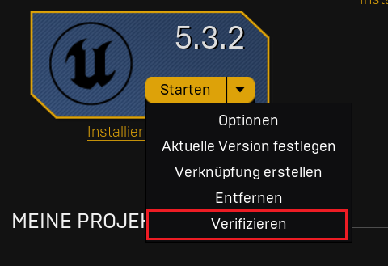
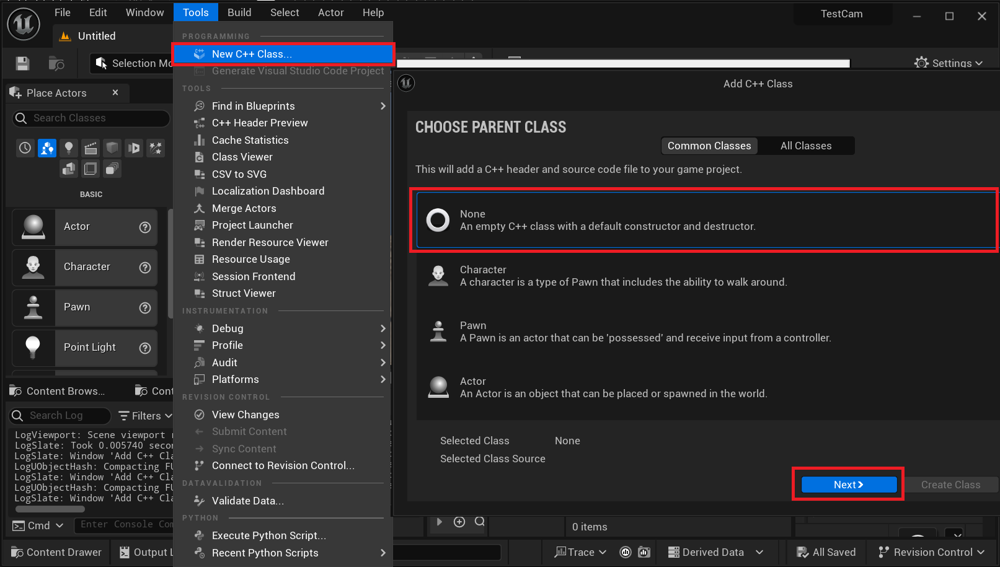
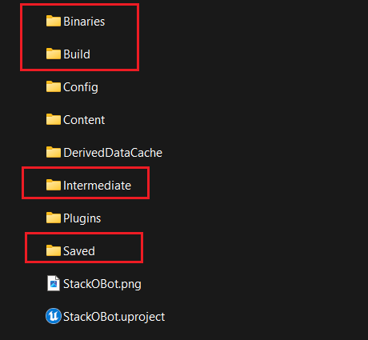
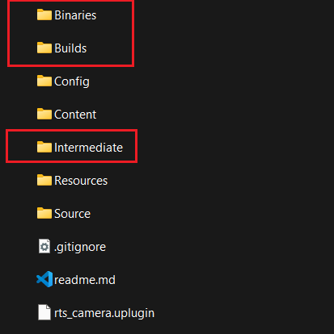
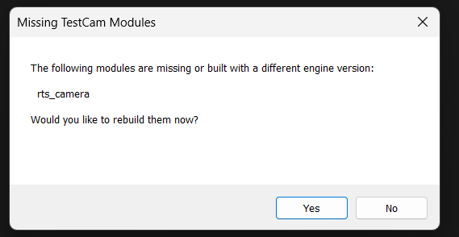

# Phoinix Troubleshooting Guide
*Welcome to this UE5 General Troubleshooting Guide for Plugins! This comprehensive guide aims to provide you with practical solutions to common issues you may encounter while working with the plugin in Unreal Engine 5. Whether you're facing compatibility problems, performance issues, or bugs, this guide will help you navigate through the first troubleshooting process effectively, allowing us to work on the problems more easily.*

> :warning: Make sure to backup the complete project before you proceed.

## 1. Make sure drivers are up-to-date
It is crucial to ensure that your GPU drivers are up-to-date for optimal performance and compatibility with the latest engine version. To update your NVIDIA GPU drivers, you can visit the official NVIDIA website at https://www.nvidia.com/en-in/drivers/nvidia-update/ for a step-by-step guide on how to update your drivers and take advantage of the latest improvements and bug fixes provided by NVIDIA. For AMD you can visit https://www.amd.com/en/support/kb/faq/dh-016

## 2. Verify the engine installation
Verifying the engine installation ensures that the Unreal Engine is correctly installed and set up on your system. This helps in avoiding potential issues related to incomplete or incorrect installation, ensures that the engine is ready for use by confirming the presence of all necessary components and dependencies, and can contribute to a smooth and efficient development process.
To do it, open the Epic Games launcher, and under library, you will find your engine installation.
Use the arrow next to the start button and select verify. It can take quite some time.

## 3. Convert your project into a C++ Project
In Unreal Engine, when using a C++ plugin in a Blueprint project, it is sometimes necessary to create an empty C++ class in the project to avoid issues. This behavior can be observed when working with plugins and Blueprints. By creating an empty C++ class in the project, it helps ensure proper inheritance and class loading within the Unreal Engine environment. 

Open the project and select under tools->new C++ Class...
Select in the window "None" and click on next. Select a name and "Create class". 
This is already it. Make sure to proceed with the next step before retrying. 

## 4. Delete Intermediate, Build, Saved and Binaries folder
> :warning: **Make sure to backup the complete project before you proceed.** 
> Please also make sure you've completed all previous steps.

Deleting the Binaries, Build, Intermediate and Saved folders in Unreal Engine can help resolve various issues, such as compilation errors, packaging problems, and some unexpected bugs. By deleting these folders, the engine's shader compiler or other processes can create new, healthy versions of these folders, which may resolve any corrupted or problematic files. Specifically, for this plugin, as it is written in C++, the binaries and intermediates can be deleted to trigger the regeneration to recompile everything from the project, including classes and shaders.
However, it's very important to make a backup of your project before deleting any of these folders to avoid any potential loss of data. 

Open your Unreal Engine project and delete the folders inside your project and inside the plugins' folder.

**Make sure to also delete these in the Plugins that you've pasted in as well, e.g. YourProject/Plugins/[Plugin].**

After deleting these folders, you will be asked to rebuild. Select yes.

After that, your project will start normally. Please note it can take much more time.

## 5. Migrated Projects and Source Code
If you have migrated from previous Engine versions, it might lead to problems with the plugin.
It can be helpful to try the plugin on a new project. If it works well in this new project, it makes sense to investigate the change log of the engine and search for related parts. 
Please also note that you have full access to the plugin's source code. You can rebuild it completely inside your own IDE and debug it as well. If you have found the issue, please do not hesitate to open a pull request to improve the plugin. Thank you.

## 6. Reinstall the plugin
You can try to reinstall the plugin and delete the "intermediate" and "binaries" folder before running for the first time. It will force the engine to rebuild the plugin.
